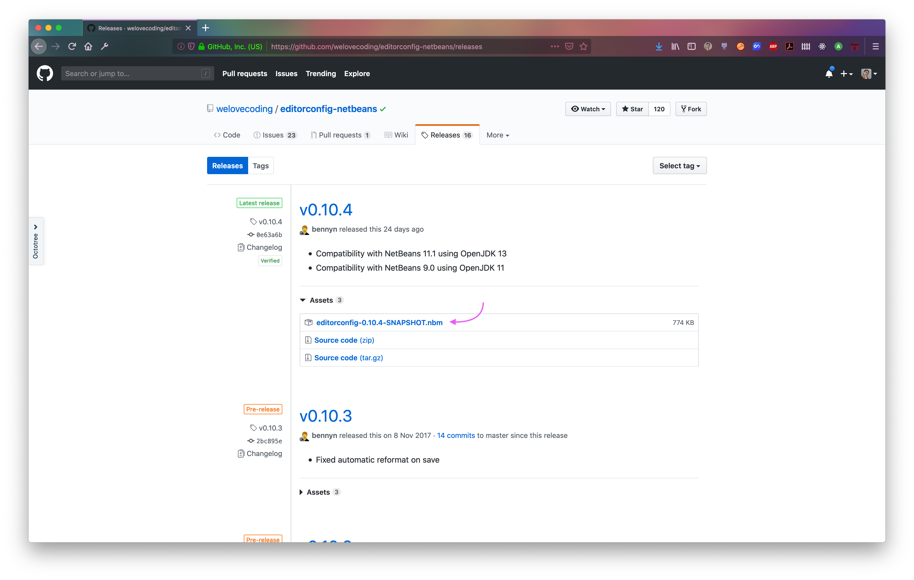
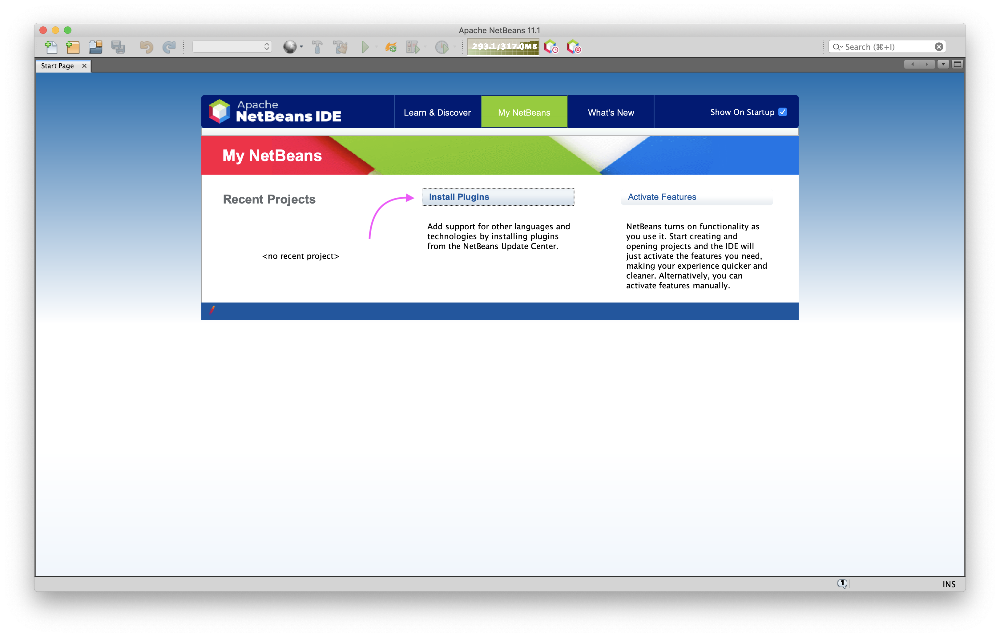
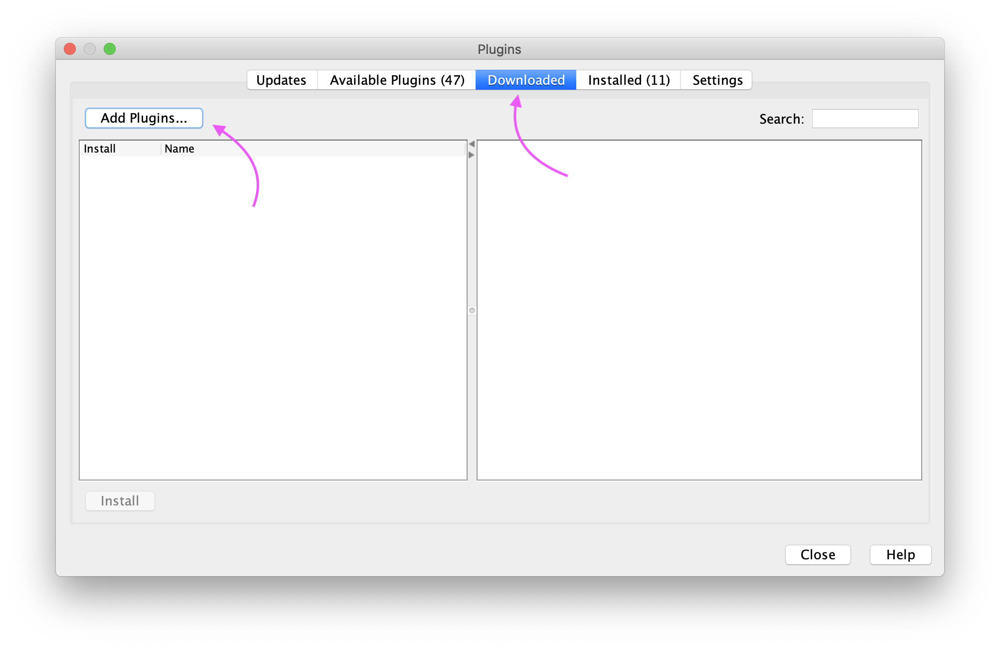
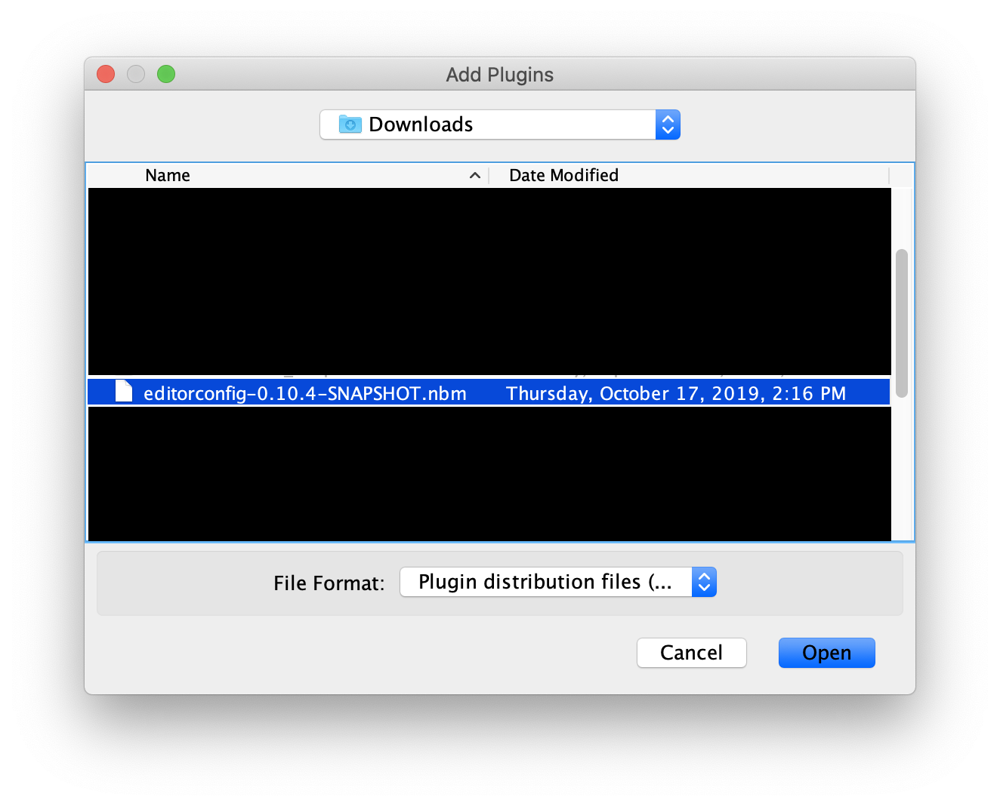
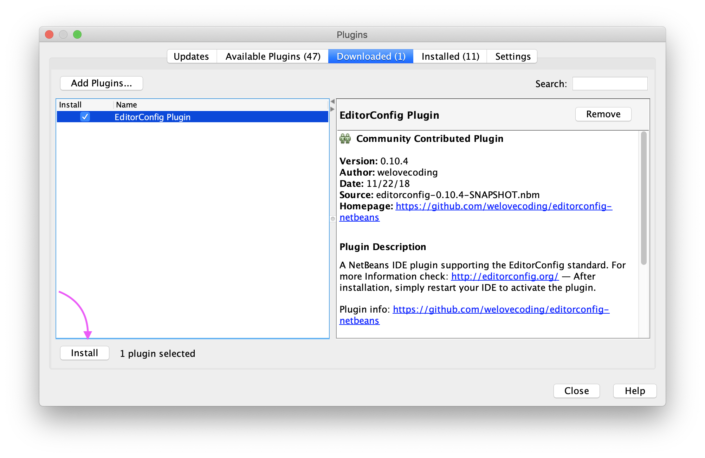
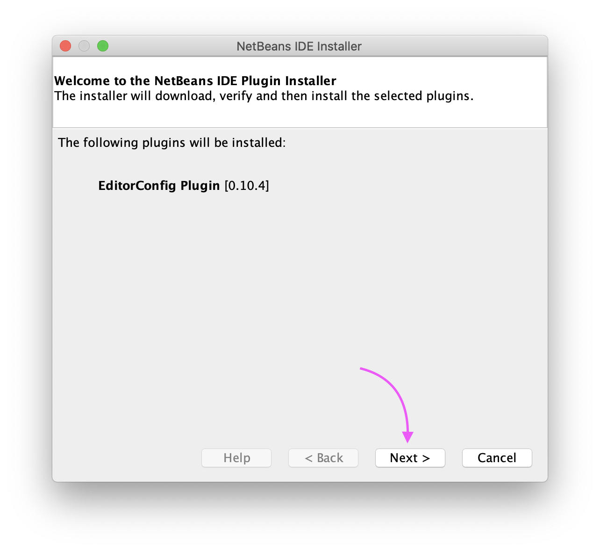
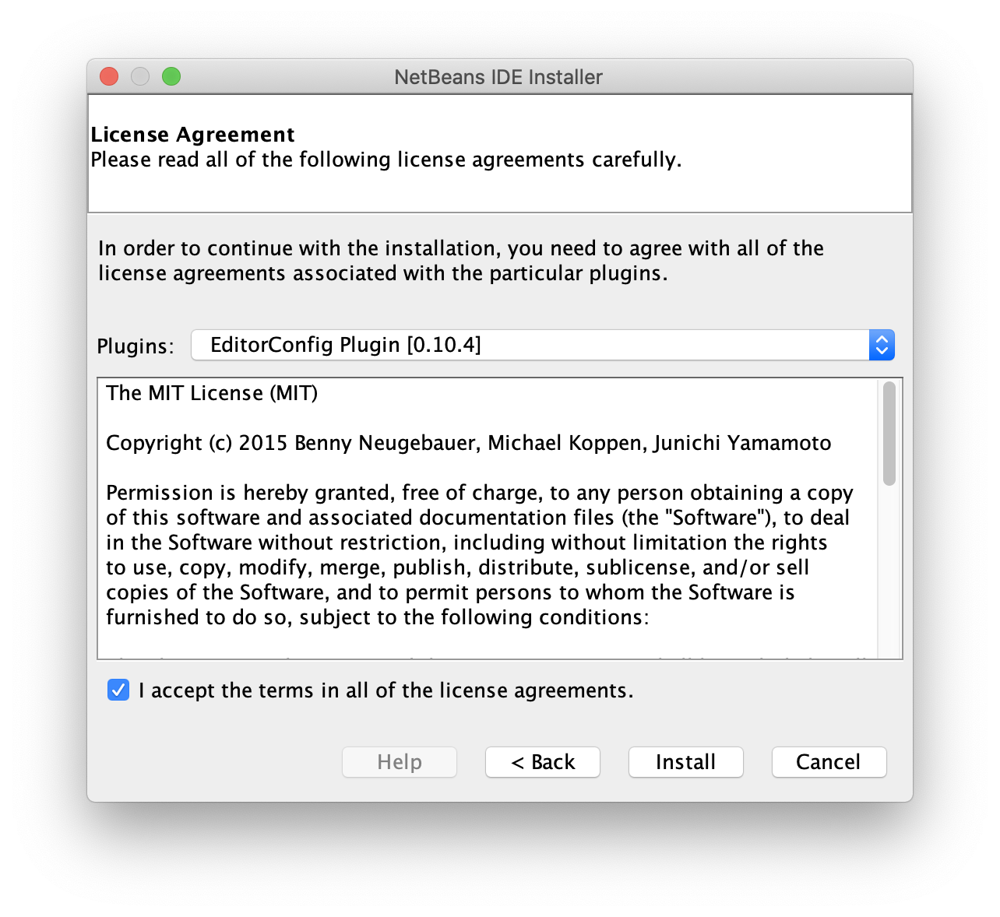
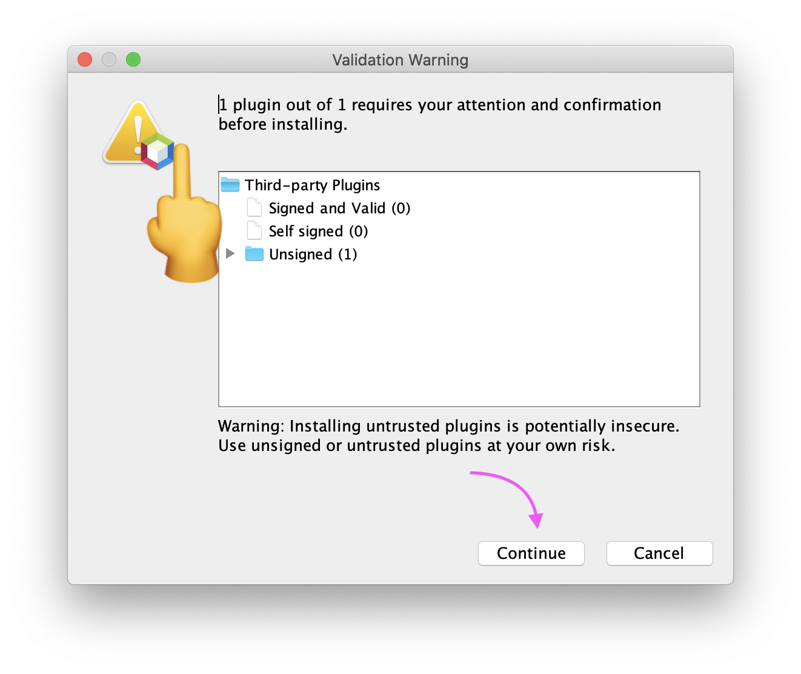
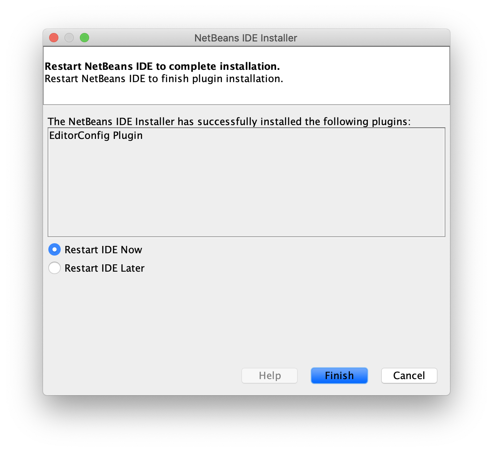

# Adicionando EditorConfig no NetBeans

O [`EditorConfig`](https://editorconfig.org/) é um projeto de plugin para padronização de formatação que é compatível através de múltiplos editores e IDEs.

Ele geralmente está presente na loja de plugins, extensões, addons ou sei lá qual o nome na sua IDE.

_Obs.: Caso não tenha disponível na loja do **NetBeans**, bem provável, você terá que seguir o tutorial para o **NetBeans** abaixo._

## Como instalar

### NetBeans

Não sei como ainda fico surpreso, mas o NetBeans não tem o `EditorConfig` na loja de plugins padrão da versão que utilizo...

### Passo 1

Fazer download do plugin no link a seguir: [link](https://github.com/welovecoding/editorconfig-netbeans/releases).

Faça download do arquivo `.nbm` no release mais ao topo da lista.

### Passo 2

Abrir a janela de instalação de plugins do NetBeans.

### Passo 3

Abrir a aba `Downloaded`, ou semelhante, da janela que apareceu no item anterior e, em seguida, clicar em `Add Plugins`.

### Passo 4

Selecionar o arquivo `.nbm` baixado no [Passo 1](#passo-1)

### Passo 5

Pressionar `Install`

### Passo 6

`Next, next, next` até chegar no Baidu...

### Passo 7

Aceitar os termos do ~~baidu~~ plugin.

### Passo 8

_Se_ o NetBeans pistolar, ignora e pressiona `Continue`

### Passo 9

Só reiniciar a IDE que o `EditorConfig` deve estar ativado

